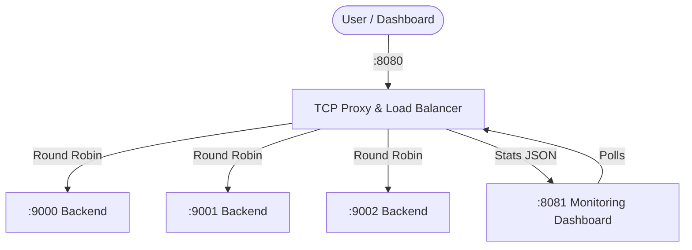

# 🚀 Learn TCP Proxy, Load Balancer & Rate Limiter

A high-performance, low-level TCP proxy and load balancer built with Go, featuring real-time observability, sliding-window rate limiting, and a sleek developer dashboard.


---

## 🔥 Impactful Features

- **⚖️ Round-Robin Load Balancing**: Automatically distributes incoming traffic across multiple backend instances to ensure high availability and balanced resource usage.
- **⚡ Low-Latency TCP Proxying**: Direct low-level handling of TCP connections, forwarding traffic seamlessly from port `8080` to your backend pool.
- **🛡️ Intelligent Rate Limiting**: Implements a **Sliding Window algorithm** (5 reqs / 10s) to guard against traffic bursts and brute-force attempts.
- **📊 Real-Time Observability**: A built-in, dark-themed dashboard providing instant visibility into:
  - **Live Access Logs**: Every request, latency, and status code.
  - **IP Heatmaps**: Per-IP request counts and limit status.
  - **Velocity Sparklines**: Real-time requests-per-second visualization.
- **🛠️ Integrated Tooling**: Trigger test requests and bursts directly from the dashboard to validate load balancing and rate-limit behavior.

---

## 🏗️ System Architecture



---

## 🚀 Quick Start

### 1. Start Multiple Backends
Open separate terminals and start your backend pool:
```bash
go run backend.go :9000
go run backend.go :9001
go run backend.go :9002
```

### 2. Start the Proxy Server
```bash
# This starts the proxy (8080) and dashboard server (8081)
go run main.go
```

You can override the backend pool with `BACKENDS` if needed:
```bash
BACKENDS=localhost:9000,localhost:9001,localhost:9002 go run main.go
```

### 3. (Optional) Run with Docker Compose
If you want to run the entire stack (Proxy + 3 Backends) in containers:
```bash
docker compose up --build
```

### 4. Open the Dashboard
Visit [http://localhost:8081](http://localhost:8081) to see the live metrics and logs.

---

## 🛠️ Technology Stack

- **Backend**: Go (Standard Library: `net`, `http`, `sync`, `bufio`, `os`)
- **Frontend**: Vanilla JS, CSS (Grid/Flexbox), HTML5
- **Design**: JetBrains Mono typography, Modern Dark UI palette

## 📝 Configuration
Current limits are defined in `main.go`:
- **Limit**: 5 requests
- **Window**: 10 seconds
- **Proxy Port**: 8080
- **Stats Port**: 8081
- **Backend Pool**: defaults to `localhost:9000`, `localhost:9001`, `localhost:9002` (override with `BACKENDS`)

---

Developed with ❤️ as a deep-dive into TCP internals and Go concurrency.
